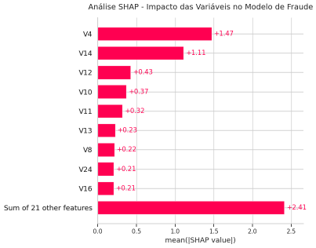

# **Bootcamp Afya – Automação de Dados com IA | Digital Innovation One (DIO)**

## Detecção de Anomalias em Transações em Python

**Autora:** Anne


---


## Visão Geral


Este projeto apresenta um benchmark comparativo de modelos de Machine Learning para detecção de fraudes em transações de cartões de crédito.


O foco do estudo é o tratamento de um dos principais desafios encontrados em problemas reais de classificação: o **desbalanceamento extremo entre as classes**. No conjunto de dados utilizado, aproximadamente **99,83%** das transações são legítimas e apenas **0,17%** representam fraudes.


O objetivo foi desenvolver um pipeline de avaliação capaz de comparar diferentes algoritmos utilizando uma metodologia padronizada, permitindo analisar desempenho preditivo, capacidade de identificar fraudes, custo computacional e interpretabilidade do modelo.


---


# Objetivos


* Comparar diferentes algoritmos de Machine Learning para detecção de fraudes.

* Avaliar o impacto do desbalanceamento extremo das classes.

* Utilizar validação cruzada para reduzir vieses estatísticos.

* Comparar tempo de treinamento entre os modelos.

* Interpretar as decisões do melhor modelo utilizando SHAP.


---


# Dataset


O projeto utiliza o conjunto de dados público disponibilizado pelo TensorFlow, originalmente derivado do Kaggle.


Características do dataset:


* 284.807 transações

* 31 atributos

* Classe altamente desbalanceada

* Variáveis anonimizadas (`V1` até `V28`)

* Variável alvo:


  * **0** → Transação normal

  * **1** → Fraude


Os dados são carregados automaticamente durante a execução do notebook, não sendo necessário armazená-los no repositório.


---


# Tecnologias Utilizadas


* Python

* Pandas

* NumPy

* Scikit-Learn

* Imbalanced-Learn

* XGBoost

* LightGBM

* CatBoost

* SHAP

* Matplotlib

* Seaborn

* Google Colab


---


# Arquitetura do Projeto


O pipeline foi organizado em etapas sequenciais:


1. Carregamento da base de dados.

2. Engenharia de atributos.

3. Preparação dos dados.

4. Validação cruzada utilizando **StratifiedKFold**.

5. Avaliação automática de múltiplos modelos.

6. Medição do tempo de treinamento.

7. Otimização do XGBoost utilizando **GridSearchCV**.

8. Comparação consolidada dos resultados.

9. Explicabilidade utilizando SHAP.


---


# Engenharia de Dados


Foi realizada uma etapa simples de Feature Engineering para reduzir a assimetria da variável monetária das transações.


As transformações utilizadas foram:


* Transformação logarítmica (`log1p`) da variável **Amount**

* Padronização utilizando **StandardScaler**


Essas transformações auxiliam modelos sensíveis à escala e reduzem a influência de valores extremos.


---


# Modelos Avaliados


Foram comparados sete algoritmos distintos:


* Logistic Regression

* Random Forest

* Balanced Random Forest

* LightGBM

* HistGradientBoosting

* CatBoost

* XGBoost otimizado com GridSearchCV


Todos os modelos foram avaliados utilizando exatamente a mesma estratégia de validação cruzada, permitindo uma comparação justa entre eles.


---


# Estratégia de Avaliação


Em problemas de fraude, a acurácia isoladamente não representa adequadamente a qualidade do modelo.


Por esse motivo, foram utilizadas as seguintes métricas:


* Recall

* Precision

* F1-Score

* ROC AUC

* Tempo de treinamento


A validação foi realizada utilizando **StratifiedKFold**, preservando a proporção da classe minoritária em todas as divisões dos dados.


---


# Resultados


Após a execução do benchmark, foi obtida a seguinte comparação entre os modelos:


```
| Modelo                 | Recall | Precision | F1-Score | ROC AUC | Tempo (s) |

| ---------------------- | :----: | :-------: | :------: | :-----: | :-------: |

| Balanced Random Forest |  0.91  |    0.06   |   0.11   |   0.98  |    8.73   |

| HistGradientBoosting   |  0.86  |    0.50   |   0.63   |   0.97  |   12.40   |

| LightGBM               |  0.85  |    0.03   |   0.06   |   0.90  |   20.00   |

| XGBoost (Otimizado)    |  0.85  |    0.68   |   0.75   |   0.98  |    9.03   |

| CatBoost               |  0.83  |    0.83   |   0.83   |   0.98  |   206.23  |

| Random Forest          |  0.79  |    0.87   |   0.83   |   0.97  |   201.87  |

| Logistic Regression    |  0.62  |    0.87   |   0.72   |   0.98  |    5.82   |
```


Os resultados evidenciam diferentes estratégias de equilíbrio entre sensibilidade, precisão e custo computacional.


Enquanto o **Balanced Random Forest** apresentou o maior Recall, o **CatBoost** e o **XGBoost otimizado** demonstraram melhor equilíbrio entre Recall, Precision e F1-Score.


---


# Explicabilidade com SHAP


Além da comparação quantitativa, o projeto utiliza **SHAP (SHapley Additive exPlanations)** para interpretar o comportamento do modelo.


Essa técnica permite identificar quais variáveis exercem maior influência na classificação de uma transação como fraudulenta, aumentando a transparência do processo de decisão.





---


# Estrutura do Repositório


```text

deteccao_de_fraudes/

│

│

├── notebooks/

│   └── DeteccaoDeFraudes.ipynb

│

├── reports/

│   └── images/

│       ├── analiseShap.png

│       └── tabela_compara.png

│   ├── DeteccaoDeFraColab.pdf

│

├── .gitignore

└── README.md

```


---
Execute diretamente no Google Colab.
---


# Conclusão


Este projeto demonstra a construção de um pipeline de benchmarking para classificação de dados altamente desbalanceados.


Além da comparação entre diferentes algoritmos de Machine Learning, o trabalho incorpora validação cruzada, otimização de hiperparâmetros, análise do custo computacional e explicabilidade utilizando SHAP, oferecendo uma visão abrangente sobre o desempenho de modelos aplicados à detecção de fraudes financeiras.


---

#  Créditos e Co-pilotagem

Projeto desenvolvido por **Anne** como parte das entregas do **Bootcamp Afya – Automação de Dados com IA**, promovido pela **Digital Innovation One (DIO)**.

### 🤖 Engenharia Assistida por Inteligência Artificial (Pipeline Multi-AI)
Este framework utilizou um processo inovador de **Co-pilotagem e Auditoria Avançada**, integrando diferentes modelos de linguagem (LLMs) de forma consultiva e em camadas sob a liderança da autora:
* **Gemini (Google):** Atuou como o co-piloto principal na arquitetura do código, refatoração de funções e eliminação de redundâncias.
* **ChatGPT (OpenAI), Copilot (Microsoft) & Perplexity AI:** Foram utilizados estrategicamente em uma etapa posterior de *Code Review*. A partir do relatório técnico em PDF, essas ferramentas atuaram como uma banca revisora, trazendo insights críticos que fundamentaram a transição para o `StratifiedKFold`, a escolha de modelos especialistas (`CatBoost` e `Balanced Random Forest`) e o uso de métricas avançadas para mitigar o *Data Leakage*.
